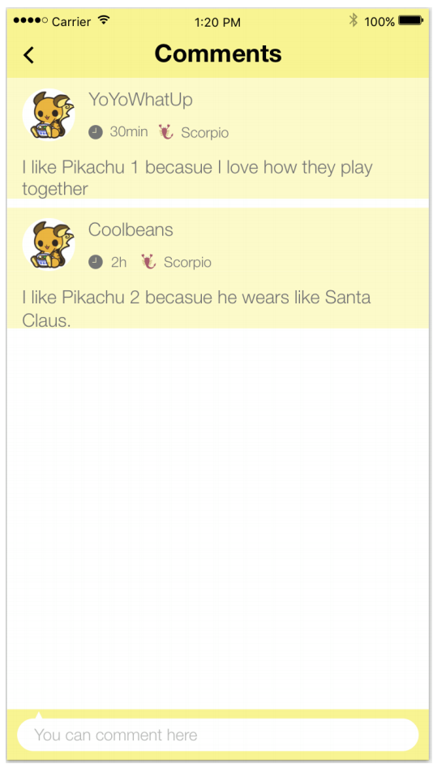
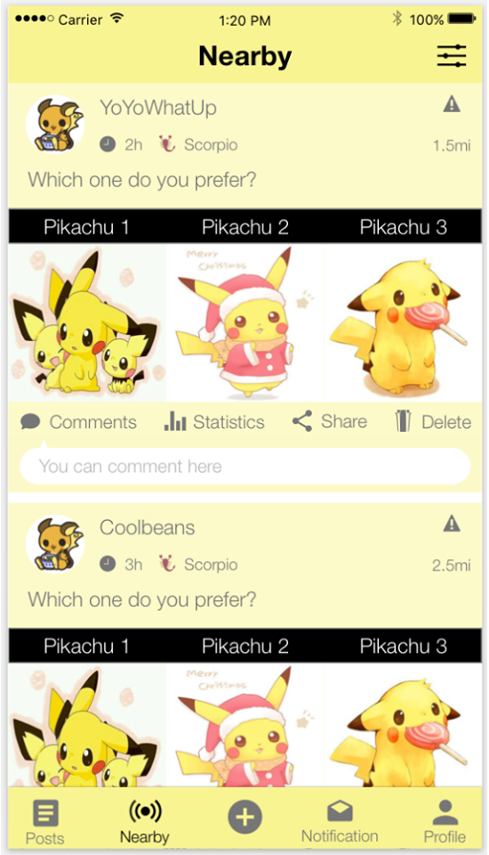
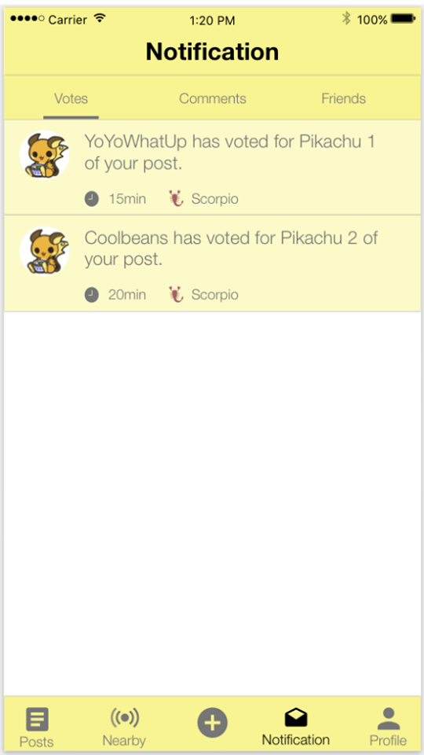

# EZDecide
# Group project Project 4 - *EZDecide*

## Wireframes

- User can login and sign up to use our app. 
- After login, user will see the Posts View. User can vote by tapping the title of the option which is on the top of the image. 
- By tapping the "+" button on the tab bar, user can compose a new question. 
- User can see all the comments of one post by tapping the comments button in the post. 
- User can comment by entering comment in the comment text field. 
- User can see his own profile by tapping the profile tab on the tab bar. 
- User can see all notifications by tapping the notification tab on the tab bar. 
- User can see nearby posts by tapping the Discover tab on the tab bar.

## User Stories

Login / Register
- [x] As a user, I would like to register an account with email.
- [x] As a user, I would like to login with my social network account (e.g. Facebook, Google+).
- [x] As a user, I would like to enter my information when I first login, such as username, date of birth, constellation, gender, etc.)
- [x] As a user, when I forget my password, I would like to reset it.
- [x] As a user, I would like to change my password. 
- [x] As a user, I would like to be able to upload my own avatar. 
Browsing
- [x] As a user, I want to view other users’ posts. 
- [] As a user, I want to be able to vote in a user’s post. 
- [] As a user, I want to filter posts to meet my interest. 
- [] As a user, I want to write comments on posts.
- [] As a user, I want to be able to view post by different order (by post time, by popularity).
- [] As a user, I want to know how many people have viewed the posts. 
- [] As a user, I want to know how many people have voted for the posts.
- [] As a user, I want to see other users’ posts on their profile views.
- [] As a user, I want to see other users’ profiles by tapping their avatars.
- [] As a user, I would like to see the data analysis of the post.
- [] As a user, I would like to share the post to other social network app.

Posts
- [] As a user, I would like to post my issue in detail.
- [] As a user, I would like to post two to four pictures as my potential decisions.
- [] As a user, I would like to label each of my potential decisions.
- [] As a user, I would like to upload pictures from my photo library or camera.
- [] As a user, I would like to limit my post voted users meet certain criteria(gender, age).
- [] As a user, I would like to post anonymously.
- [] As a user, I would like to give my post a category.
- [] As a user, I would like to select availability for my post (e.g. public, only a group of people, people who followed me)
Search
- [] As a user, I would like to filter posts by categories (e.g. Shopping, Relationship, etc). 
- [] As a user, I would like to search posts by keywords.
- [] As a user, I would like to search other user by username.

Behavior Control
- [] As a user, I would like to report bad users and posts.
- [] As a user, I would like to block certain user’s posts.

Social
- [] As a user, I would like to follow other users.

Notification
- [] As a user, I would like to receive the notification of the post that I have voted, when the decision has been made.
- [] As a user, I would like to receive the notification when other users make a post that let me make decision for them. 
- [] As a user, I would like to receive the notification of the users that I have followed when they make a new post.

Data Analysis
- [] As a user, I would like to see the voting result by gender.
- [] As a user, I would like to see the voting result by age range.
- [] As a user, I would like to see the voting result by constellation.
- [] As a user, I would like to see the overall voting result.

Here's a walkthrough of implemented user stories:

GIF created with [LiceCap](http://www.cockos.com/licecap/).

## Notes

Describe any challenges encountered while building the app.

## License

    Copyright [yyyy] [zheng wu]

    Licensed under the Apache License, Version 2.0 (the "License");
    you may not use this file except in compliance with the License.
    You may obtain a copy of the License at

        http://www.apache.org/licenses/LICENSE-2.0

    Unless required by applicable law or agreed to in writing, software
    distributed under the License is distributed on an "AS IS" BASIS,
    WITHOUT WARRANTIES OR CONDITIONS OF ANY KIND, either express or implied.
    See the License for the specific language governing permissions and
    limitations under the License.
